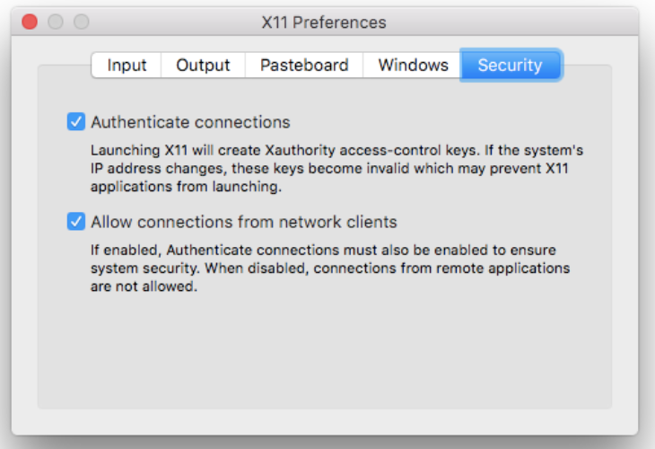

# Smart Mirror

### Introduction
Nearly everything in our household is turning *smart*. There are smart phones, smart watches, smart tv’s, smart refrigerators, and even smart washing machines. Why not Smart Mirrors?

Our smart mirror will be used to convenience people during their morning routines as they brush, apply makeup, do their hair, and even try on outfits. It will display the weather so you know how to dress; it has the news, stocks, traffic data for you to keep updated, and of course it will have a clock and include traffic data to keep you from running late to work.

### Features
- Hand recognition technology for hands free use
- Automatically turns on when you approach the mirror
- Personalized widgets for the time, weather, and news, calendar, todolist, stocks
- Customizable font sizing and coloring of the widgets

### Technologies
- Docker
- Python
- TKinter
- OpenCV Library
- Raspberry Pi
- RPI Sensors & Componets
- Google & Darksky APIs 


### Microservice Architecture 
- servicegui: Reads data from filesystem to create the GUI. (text on the mirror)
- serviceweb: Makes API calls or crawls web for data
- servicecamera: Provides hand recognition to nagivate through GUI
- serviceultrasound: Used as a distance senseor to turn on/off mirror automatically
- servicejoystick: Used as an alternative to navigate through GUI
NOTE: that not all services need to be deployed. 


### Navigating and Updating the GUI
Navigating - You can use the keyboard to navigate through the GUI, using arrow keys and the backspace button to "click" on things. If you do not wish to use a camera or joystick. \

Updating - To change the information on the GUI, use the website provided that will sync with your mirror. https:// mysmartmirror.herokuapp.com . To view the source code for this web application - https://github.com/josephkphan/SmartMirrorServer  

### Running on Mac
- Install XQuartz: This is to allow the container to access your display to open a GUI. 
``` 
brew cask install xquartz
open -a XQuartz
```
 \
In the XQuartz preferences, go to the “Security” tab and make sure you’ve got “Allow connections from network clients" checked. Then Restart your mac for the settings to apply.

- Install Docker
```
brew cask install docker
```

- Start the application 
```
docker-compose up -d
```


### Running on Ubuntu
- Install Docker
```
sudo apt-get update
sudo apt-get install docker-ce
```
- Start the application
```
docker-compose up -d
```

### Application Screenshots


