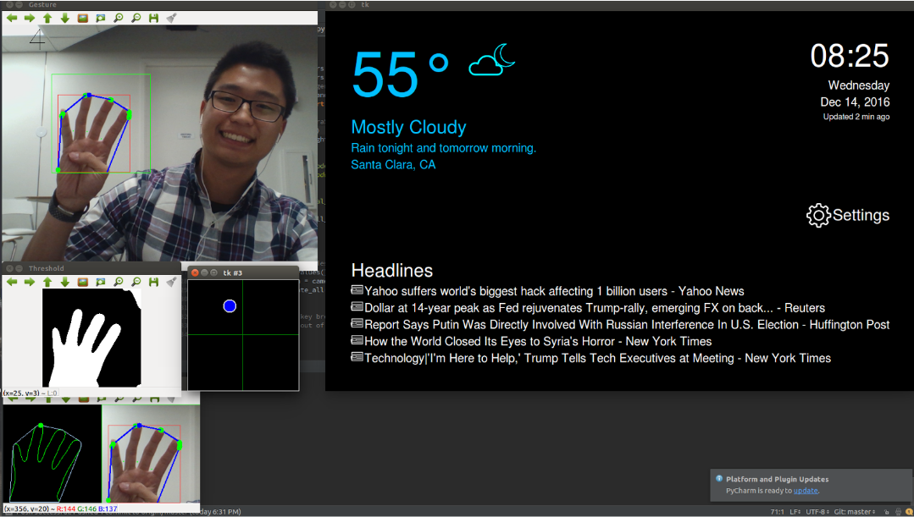
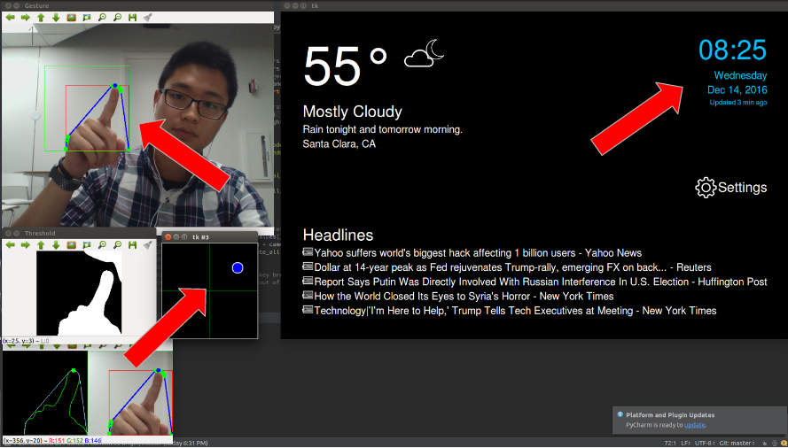
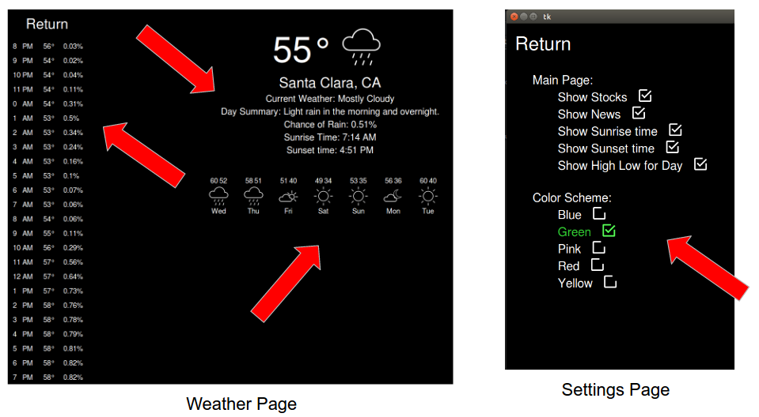

# Smart Mirror

### Introduction
Nearly everything in our household is turning *smart*. There are smart phones, smart watches, smart tv’s, smart refrigerators, and even smart washing machines. Why not Smart Mirrors?

Our smart mirror will be used to convenience people during their morning routines as they brush, apply makeup, do their hair, and even try on outfits. It will display the weather so you know how to dress; it has the news, stocks, traffic data for you to keep updated, and of course it will have a clock and include traffic data to keep you from running late to work.

### Features
- Hand recognition technology for hands free use
- Automatically turns on when you approach the mirror
- Personalized widgets for the time, weather, and news
- Customizable locations and coloring of the weidgets

### Technologies
- Python
- OpenCV Library
- TKinter
- Raspberry Pi
- Google Finance

### Example

